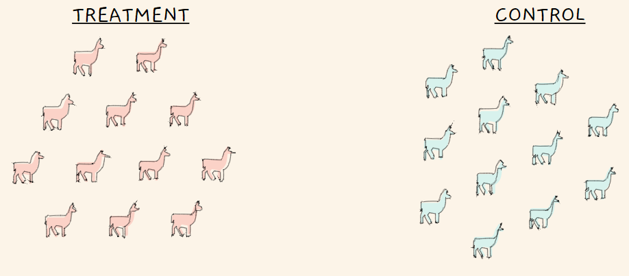
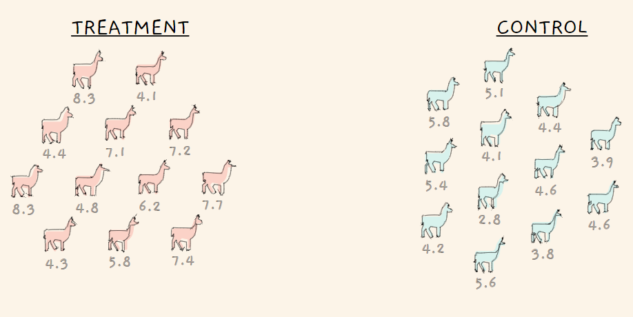
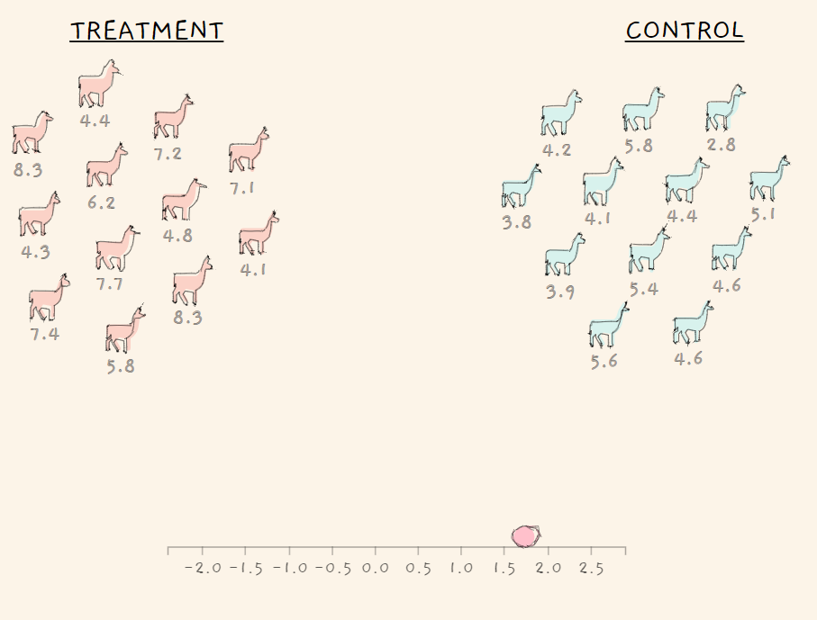
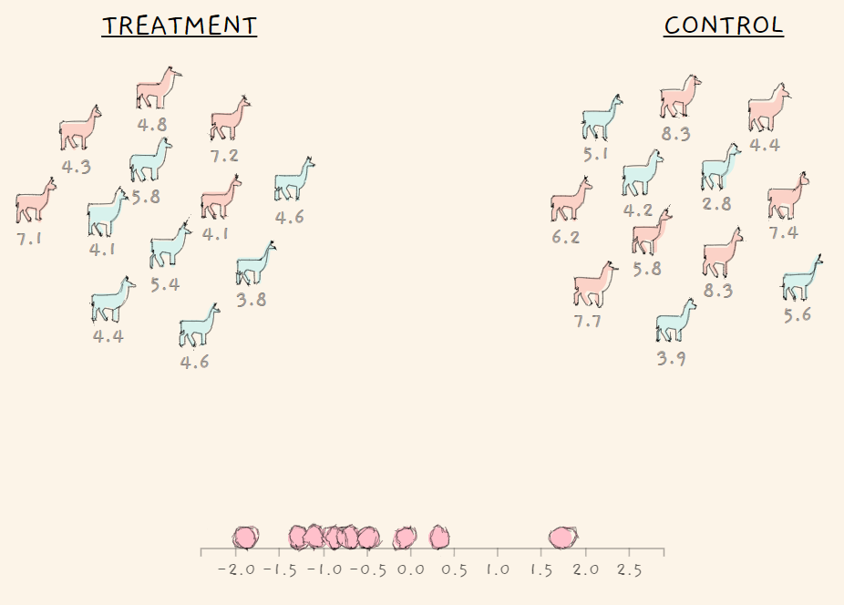
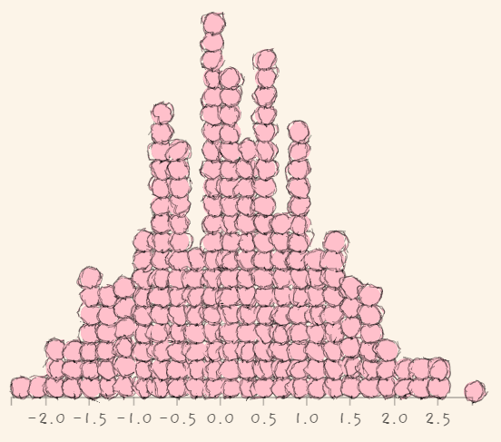
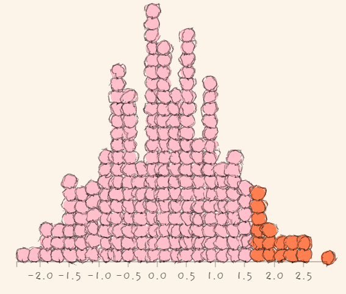

<a name="content">目录</a>

[统计学进阶](#title)
- [1. Beta分布](#beta-distribution)
    - [1.1. Beta分布及其函数公式推导](#beta-distribution-and-its-formulas-derivation)
    - [1.2. Beta 函数和 Gamma 函数的关系](#relation-between-beta-func-with-gamma-func)
    - [1.3. Beta 分布的期望与方差](#expectation-and-variance-of-beta-distribution)
    - [1.4. Beta分布与二项分布的关系](#relation-between-beta-distribution-and-binomial-distribution)
    - [1.5. Beta分布与均匀分布的关系](#relation-between-beta-distribution-and-uniform-distribution)
- [2. Permutation Test](#permutation-test)
  - [2.1. 用Permutation Test进行单次假设检验——empirical permutation p-values](#permutation-test-for-hyposis-test)
    - [2.1.1. 原理](#permutation-test-for-hyposis-test-principle)
    - [2.1.2. R实现](#permutation-test-for-hyposis-test-in-r)
  - [2.2. 利用Permutation Test进行多重假设检验的FDR校正](#permutation-test-for-fdr-correction)
  - [2.3. 用R做permutation test](#permutation-test-use-r)


<h1 name="title">统计学进阶</h1>

<a name="beta-distribution"><h2>1. Beta分布 [<sup>目录</sup>](#content)</h2></a>

Beta分布是一种**连续型概率密度分布**，表示为$x \sim Beta(a,b)$，由两个参数$a,b$决定，称为形状参数

由于其定义域为(0,1)，一般被用于建模**伯努利试验事件成功的概率**的概率分布：

> 对于硬币或者骰子这样的简单实验，我们事先能很准确地掌握系统成功的概率
>
> 然而通常情况下，系统成功的概率是未知的，但是根据频率学派的观点，我们可以通过频率来估计概率
>
> 为了测试系统的成功概率，我们做n次试验，统计成功的次数k，于是很直观地就可以计算出。然而由于系统成功的概率是未知的，这个公式计算出的只是系统成功概率的最佳估计。也就是说实际上也可能为其它的值，只是为其它的值的概率较小。因此我们并不能完全确定硬币出现正面的概率就是该值，所以也是一个随机变量，它符合Beta分布，其取值范围为0到1

用一句话来说，beta分布可以看作一个概率的概率密度分布，当你不知道一个东西的具体概率是多少时，它可以给出了所有概率出现的可能性大小

<a name="beta-distribution-and-its-formulas-derivation"><h3>1.1. Beta分布及其函数公式推导 [<sup>目录</sup>](#content)</h3></a>

如果随机变量 $X$ 服从参数为 $n$ 和 $p$ 的二项分布，那么它的概率由概率质量函数（对于连续随机变量，则为概率密度函数）为：

$$p(x)=\begin{pmatrix}n\\ x\\ \end{pmatrix}q^x(1-q)^{n-x}\tag{1}$$

把 $(1)$ 表示为变量 $q$ 的函数，即只有 $q$ 这一个变量，写成如下形式

$$f(q)\propto q^a(1-q)^b\tag{2}$$

其中 $a$ 和 $b$ 是常量，$q\in(0,1)$

为了把 $(2)$ 变成一个分布，可以给它乘上一个因子，使它对 $q$ 从0到1积分为1即可，即

$$f(q) = kq^a(1-q)^b\tag{3}$$

令其积分为1

$$\int_0^1 f(q)\mathbf dq = \int_0^1 kq^a(1-q)^b \mathbf dq=k\int_0^1 q^a(1-q)^b \mathbf dq=1 \tag{4}$$

则

$$k=\frac{1}{\int_0^1 q^a(1-q)^b \mathbf dq}$$

记 $B(a+1,b+1)=\int_0^1 q^a(1-q)^b \mathbf dq$，则 $k=B(a+1,b+1)^{-1}$，所以

那么规范化后的 (2) 就是一个分布了 

$$f(q;a+1,b+1) = \frac{1}{B(a+1,b+1)}q^a(1-q)^b\tag{5}$$

这就是Beta分布的最原始的来源

对（5）进行适当的改造：取$\alpha=a+1,\beta=b+1$，并将积分 $B(a+1,b+1)=\int_0^1 q^a(1-q)^b \mathbf dq$ 中的q改为t，我们就得到了我们在教材上看到的Beta函数了：

$$B(\alpha,\beta)=\int_0^1 t^{\alpha-1}(1-t)^{\beta-1} \mathbf dt\tag{6}$$

另外，将（5）中的q改为x，则我们就得到了我们在教材上看到的Beta分布的函数：

$$f(x;\alpha,\beta) = \frac{1}{B(\alpha,\beta)}x^{\alpha-1}(1-x)^{\beta-1}\tag{7}$$

到这里我们已经完整地推出了Beta函数（公式(6)）和Beta分布（公式(7)）

<a name="relation-between-beta-func-with-gamma-func"><h3>1.2. Beta 函数和 Gamma 函数的关系 [<sup>目录</sup>](#content)</h3></a>

先做一下前期的推导：

<p align="center"></p>

假设向长度为1的桌子上扔一个红球（如上图），它会落在0到1这个范围内，设这个长度值为 $x$ ，再向桌上扔一个白球，那么这个白球落在红球左边的概率即为 $x$。 若一共扔了 $n$ 次白球，其中每一次都是相互独立的，假设落在红球左边的白球数量为 $k$，那么随机变量 $K$ 服从参数为 $n$ 和 $x$ 的二项分布，即 $K∼b(n,x)$，有

$$P(K=k|x)=\begin{pmatrix}n\\ k\\ \end{pmatrix}x^k(1-x)^{n-k}\tag{1}$$

$X$ 服从 $[0,1]$ 上的均匀分布，即 $X∼U[0,1]$

$K$ 对每一个 $x$ 都有上面的分布，对于所有可能的 $x$，$K$ 的分布为

$$P(K=k)=\int_0^1 \begin{pmatrix}n \\ k\\ \end{pmatrix}x^k(1-x)^{n-k}\mathbf dx
=\begin{pmatrix}n\\ k\\ \end{pmatrix}\int_0^1 x^k(1-x)^{n-k}\mathbf dx\tag{2}$$

现在，我们换一种方式来丢球：

> 先将这 $n+1$ 个球都丢出来，再选择一个球作为红球，任何一个球被选中的概率均为 $\displaystyle 1 \over n+1$，此时红球左边有 $0,1,2...n$ 个球的概率均为 $\displaystyle 1 \over n+1$，有
>
> $$P(K=k)=\int_0^1 \begin{pmatrix}n\\ k\\ \end{pmatrix}x^k(1-x)^{n-k}\mathbf dx
=\begin{pmatrix}n\\ k\\ \end{pmatrix}\int_0^1 x^k(1-x)^{n-k}\mathbf dx=\frac{1}{n+1}$$
>
> 则
>
> $$\int_0^1 x^k(1-x)^{n-k}\mathbf dx=\frac{(n-k)!k!}{n!}\frac{1}{n+1}=\frac{k!(n-k)!}{(n+1)!}\tag{3}$$

再来看看$\Gamma$函数的定义：

$$\Gamma(m) = \int_0^{+\infty} e^{-x} x^{m-1} \mathbf dx=(m-1)!\tag{4}$$

（4）在定义域为整数时，即 $m \in Z$ 时，才满足等于$(m-1)!$

那么，现在我们就可以推导出$\Gamma$函数与Beta函数的关系了：

由于

$$B(\alpha,\beta)=\int_0^1 t^{\alpha-1}(1-t)^{\beta-1} \mathbf dt$$

根据(3)，可令$k=\alpha-1,n-k=\beta-1\quad \Rightarrow \quad n=a+b-2$，则

$$B(\alpha,\beta)=\int_0^1 t^{\alpha-1}(1-t)^{\beta-1} \mathbf dt=\frac{(\alpha-1)!(\beta-1)!}{(\alpha+\beta-1)!}$$

又由于(4)，可得

$$B(\alpha,\beta)=\frac{\Gamma(\alpha)\Gamma(\beta)}{\Gamma(\alpha+\beta)}$$

因此，Beta分布也可以写成下面的形式：

$$f(x;\alpha,\beta) = \frac{1}{B(\alpha,\beta)}x^{\alpha-1}(1-x)^{\beta-1}=\frac{\Gamma(\alpha+\beta)}{\Gamma(\alpha)\Gamma(\beta)}x^{\alpha-1}(1-x)^{\beta-1}$$

<a name="expectation-and-variance-of-beta-distribution"><h3>1.3. Beta 分布的期望与方差 [<sup>目录</sup>](#content)</h3></a>

- Beta 分布的期望

    $$
    \begin{aligned}
    &\quad E[X] \\
    &= \int_0^1 x f(x;\alpha,\beta) \\
    &= \int_0^1 x \frac{x^{\alpha-1}(1-x)^{\beta-1}} {B(\alpha,\beta) }  \mathbf dx \\
    &= \frac{1} {B(\alpha,\beta)} \int_0^1 x^{\alpha}(1-x)^{\beta-1} \mathbf dx \\
    &= \frac{B(\alpha+1,\beta)}{B(\alpha,\beta)} \\
    &= \frac{\Gamma(\alpha+1)\Gamma(\beta)}{\Gamma(\alpha+\beta+1)}\frac{\Gamma(\alpha+\beta)}{\Gamma(\alpha)\Gamma(\beta)} \\
    &= \frac{\alpha}{\alpha+\beta}
    \end{aligned}
    $$

- Beta 分布的方差

    由于$Var[X]=E(X^2)-E(X)^2$

    > $$\begin{aligned}&\quad Var[X] \\ &=E\left [(X-E[X])^2 \right ]\\ &=E \left [X^2-2XE(X)+E[X]^2 \right ] \\ &= E[X^2]-2E[X]E[X]+E[X]^2 \\ &= E(X^2)-E(X)^2\end{aligned}$$

    那么，先求$E(X^2)$

    $$
    \begin{aligned}
    &\quad E(X^2) \\
    &= \int_{-\infty}^{\infty} x^2f(x)dx \\
    &= \int_0^1 x^2 \frac{1}{B(\alpha,\beta)}x^{\alpha-1}(1-x)^{\beta-1}dx \\
    &= \frac{1}{B(\alpha,\beta)} \int_0^1 x^{\alpha+1}(1-x)^{\beta-1}dx \\
    &= \frac{B(\alpha+2,\beta)}{B(\alpha,\beta)} \\
    &= \frac{\Gamma(\alpha+2)\Gamma(\beta)}{\Gamma(\alpha+\beta+2)}\frac{\Gamma(\alpha+\beta)}{\Gamma(\alpha)\Gamma(\beta)} \\
    &= \frac{[\Gamma(\alpha)(\alpha+1)\alpha]\Gamma(\beta)}{\Gamma(\alpha+\beta)(\alpha+\beta+1)(\alpha+\beta)}\frac{\Gamma(\alpha+\beta)}{\Gamma(\alpha)\Gamma(\beta)} \\
    &= \frac{(\alpha+1)\alpha}{(\alpha+\beta+1)(\alpha+\beta)}
    \end{aligned}
    $$

    接着求$Var[X]$

    $$
    \begin{aligned}
    &\quad Var[X] \\
    &= E[X^2]-E[X]^2 \\
    &= \frac{(\alpha+1)\alpha}{(\alpha+\beta+1)(\alpha+\beta)} - \left (\frac{\alpha}{\alpha+\beta} \right )^2 \\
    &= \frac{(\alpha+1)(\alpha+\beta)\alpha-(\alpha+\beta+1)\alpha^2}{(\alpha+\beta+1)(\alpha+\beta)^2} \\
    &= \frac{\alpha\beta}{(\alpha+\beta+1)(\alpha+\beta)^2}
    \end{aligned}
    $$

- Beta分布的概率分布函数

    由于Beta分布是概率密度分布，我们可以通过积分，得到它的概率分布函数

    $$
    \begin{aligned}
    &\quad F(x) \\
    &= \int_{-\infty}^x f(x)dx \\
    &= \int_0^x \frac{1}{B(\alpha,\beta)}x^{\alpha-1}(1-x)^{\beta-1} dx \\
    &= \frac{1}{B(\alpha,\beta)} \int_0^x x^{\alpha-1}(1-x)^{\beta-1} dx
    \end{aligned}
    $$

    定义$B(x,\alpha,\beta)=\int_0^x x^{\alpha-1}(1-x)^{\beta-1}$，称为不完全Beta函数（incomplete Beta function）则

    $$F(x)=\frac{B(x,\alpha,\beta)}{B(\alpha,\beta)}$$

<a name="relation-between-beta-distribution-and-binomial-distribution"><h3>1.4. Beta分布与二项分布的关系 [<sup>目录</sup>](#content)</h3></a>

> 进行n次伯努利试验，其出现试验成功的概率p服从一个先验概率密度分布$Beta(\alpha,\beta)$，试验结果出现k次试验成功，则试验成功的概率p的后验概率密度分布为$Beta(\alpha+k,\beta+n-k)$

证明：

假设试验场景为棒球击球试验

该运动员击球时间的概率图模型如下图：

<p align="center"></p>

假设该用户的击球率的分布是一个参数为 $\theta$ 的分布（这里 $\theta$ 既表示一个分布，也是这个分布的参数。因为在概率图模型中，我们经常使用某个分布的参数来代替说明某个模型），也就是说 $\theta$ 是用户击球成功的概率

假设，到目前为止，用户在这个赛季总共打了 $n$ 次球，击中的次数是 $k$，结果记为 $y=(k,n)$ 这是一个二项式分布，即 $p(y \mid \theta) = \text{Binomial}(k;n,\theta)$（$y$表示：总共打了 $n$ 次球，击中的次数是 $k$ 这个事件）

> $y$是离散随机变量，则$y$服从的是概率质量函数（probability mass function）$P(y\mid n,\theta)=Binomial(k;n,\theta)$
>
> $\theta$是连续随机变量，则$\theta$服从的是概率密度函数（probability density function）$p(\theta\mid \alpha,\beta)=Beta(\alpha,\beta)$

则$\theta$与$y$的联合概率密度函数为

$$
\begin{aligned}
&\quad f(\theta,y\mid \alpha,\beta) \\
&= f(\theta \mid \alpha,\beta)p(y \mid \theta) \\
&= \frac{1}{B(\alpha,\beta)}\theta^{\alpha-1}(1-\theta)^{\beta-1} \begin{pmatrix}n \\ k\end{pmatrix}\theta^{k}(1-\theta)^{n-k} \\
&= \frac{1}{B(\alpha,\beta)}\begin{pmatrix}n \\ k\end{pmatrix}\theta^{\alpha+k-1}(1-\theta)^{\beta+n-k-1} \\
&= \frac{B(\alpha + k ,\beta + n -k)}{B(\alpha,\beta)}\begin{pmatrix}n \\ k\end{pmatrix} \frac{1}{B(\alpha + k ,\beta + n -k)}\theta^{\alpha+k-1}(1-\theta)^{\beta+n-k-1} \\
&= h(y)g(\theta,y)
\end{aligned}
$$

其中，

$$h(y)=\frac{B(\alpha + k ,\beta + n -k)}{B(\alpha,\beta)}\begin{pmatrix}n \\ k\end{pmatrix}$$

$h(y)$与$\theta$无关

$$g(\theta,y)=\frac{1}{B(\alpha + k ,\beta + n -k)}\theta^{\alpha+k-1}(1-\theta)^{\beta+n-k-1}$$

$g(\theta,y)$其实就是形状参数为$\alpha + k ,\beta + n -k$的Beta分布

现在，我们需要求出$\theta$在给定$y$情况下的后验分布$f(\theta\mid y,\alpha,\beta)$

由于$f(\theta,y\mid \alpha,\beta)=f(\theta\mid y,\alpha,\beta)f(y \mid \alpha,\beta)$，而其中的$f(\theta,y\mid \alpha,\beta)$就是上面我们推导出的$\theta,y$的联合概率密度分布，$f(y \mid \alpha,\beta)$是$y$的边际概率密度分布（marginal probability density function）

$$
\begin{aligned}
&\quad f(y \mid \alpha,\beta) \\
&= \int_{-\infty}^{\infty}f(\theta,y\mid \alpha,\beta)d\theta \\
&= \int_0^1 h(y)g(\theta,y)d\theta \\
&= h(y)\int_0^1 g(\theta,y)d\theta \\
&= h(y)
\end{aligned}
$$

因此

$$f(\theta\mid y,\alpha,\beta)=g(\theta,y)=Beta(\alpha + k ,\beta + n -k)$$


<a name="relation-between-beta-distribution-and-uniform-distribution"><h3>1.5. Beta分布与均匀分布的关系 [<sup>目录</sup>](#content)</h3></a>

当$\alpha=1,\beta=1$的时候，它就是一个均匀分布

$$
f(x;\alpha=1,\beta=1)=\frac{\Gamma(\alpha+\beta)}{\Gamma(\alpha)\Gamma(\beta)}x^{\alpha-1}(1-x)^{\beta-1}=\frac{\Gamma(2)}{\Gamma(1)\Gamma(1)}x^0(1-x)^0=1
$$

<a name="permutation-test"><h2>2. Permutation Test [<sup>目录</sup>](#content)</h2></a>

<a name="permutation-test-for-hyposis-test"><h3>2.1. 用Permutation Test进行单次假设检验——empirical permutation p-values [<sup>目录</sup>](#content)</h3></a>

<a name="permutation-test-for-hyposis-test-principle"><h4>2.1.1. 原理 [<sup>目录</sup>](#content)</h4></a>

假如你是羊驼牧羊人。 就像任何羊驼牧羊犬都会告诉您的那样，您最需要关注的是羊群的羊毛质量。

库斯科街头有消息说，一种流行的新型洗发水可提高羊驼毛的羊毛质量。 但是，您不是个傻瓜-你不会人云亦云，您将确定找出答案。您将使用统计数据测试差异。

在统计测试中，我们根据原假设和替代假设构建实验。 我们的测试将具有以下假设方案：

$$
Η_0: μ_{treatment} <= μ_{control} \\
Η_A: μ_{treatment} > μ_{control}
$$

我们的零假设声称新的洗发水不会提高羊毛质量。备选假设则相反，新型洗发水可提供出众的羊毛质量。

- 随机化

    

    第一步，我们随机将羊驼采样的一半分配给新的洗发水，将一半分配给旧的洗发水。

    我们说，接受新洗发精的羊驼属于治疗组，其他属于对照组。 羊驼草给定饮食的分配被称为其治疗分配。

    治疗分配的随机性非常重要。 它消除了我们结果中的偏见和混淆，并为我们的统计检验理论提供了基础。

- 响应值

    

- 计算统计量

    $$\phi = μ_{Treatment} - μ_{Control}$$

    

- 通过多次permutaion，获得统计量的概率分布，即为在以零假设成立的前提下，统计量$\phi$的概率分布

    

    

- 根据统计量的概率分布，计算$\phi$不小于实际观测结果的概率p，即为下图右侧部分：

    

    那么如何计算这个p值呢？

    可以将前面的多轮permutation实验中，$\phi$大于实际观测结果的实验次数，除以总实验次数，即得到上图右侧部分概率的估计：

    $$p-value= \frac{16}{200} = 0.08$$

- 与拒绝域进行比较，来决定是否拒绝原假设

<a name="permutation-test-for-hyposis-test-principle"><h4>2.1.2. R实现 [<sup>目录</sup>](#content)</h4></a>

```R
library(qvalue)

set.seed(3333)
B = 1000 # permutation实验次数
tstats_obj = rowttests(edata,pdata$strain) # 对每行代表的基因执行t检验，该函数来自于genefilter
tstat0 = matrix(NA,nrow=dim(edata)[1],ncol=B) # 初始化permutation结果矩阵
tstat = tstats_obj$statistic
strain = pdata$strain
# 执行permutation test
for(i in 1:B){
  strain0 = sample(strain)
  tstat0[,i] = rowttests(edata,strain0)$statistic
}

# 计算empirical permutation p-values，可以在单个基因内部进行比较（基于各个基因各自的null distribution计算empirical permutation p-values，参数设置为pooled=FALSE）
# 也可以将全部基因混合得到一个共有的null distribution，各个基因基于这个共有的null distribution计算p值（参数设置为pooled=TRUE）
# p-value_i=#{x_ij|x_ij>x_i}/#{x_ij}
emp_pvals = empPvals(tstat,tstat0) # empPvals函数来自于qvalue
```

<a name="permutation-test-for-fdr-correction"><h3>2.2. 利用Permutation Test进行多重假设检验的FDR校正 [<sup>目录</sup>](#content)</h3></a>

在【Li et al, Nat Genet, 2016】这篇文章中，就使用了这种方法

问题：

> 给定癌症样本的TCR CDR3 motif的检出情况——motif sharing matrix
> 
> | ` ` | motif1 | motif2 | ... | motifi | ... |
> |:---|:---|:---|:---|:---|:---|
> | sample1 | 1 | 0 | ... | 0 | ... |
> | sample2 | 0 | 0 | ... | 1 | ... |
> | ... | ... | ... | ... | ... | ... |
> | samplej | 0 | 1 | ... | 0 | ... |
> | ... | ... | ... | ... | ... | ... |
> 
> 与各样本中的基因组错义突变的检出情况——NS mutation sharing matrix
> 
> | ` ` | NM1 | NM2 | ... | NMi | ... |
> |:---|:---|:---|:---|:---|:---|
> | sample1 | 1 | 0 | ... | 0 | ... |
> | sample2 | 0 | 0 | ... | 1 | ... |
> | ... | ... | ... | ... | ... | ... |
> | samplej | 0 | 1 | ... | 0 | ... |
> | ... | ... | ... | ... | ... | ... |
> 
> 注：NM是nonsynonymous somatic mutations的缩写
> 
> 根据motif-mutation co-occurrences，得到co-occurrences的显著相关的motif-mutation对

（1）利用Fisher精确检验评估每个motif-mutation对，$motif_i-NM_j$的co-occurrences的显著相关性p值

| ` ` | with NMj | without NMj | total |
|:---|:---|:---|:---|
| with motifi | a | b | a + b |
| without motifi | c | d | c+ d |
| total | a + c | b + d | n |

$$p-value=\frac{\dbinom{a+c}{c}\dbinom{b+d}{b}}{\dbinom{n}{a+b}}$$

（2）进行1000次permutation：

> 打乱motif sharing matrix的样本ID，然后基于新的motif sharing matrix和NS mutation sharing matrix，基于motif-mutation pairs的co-occurrences进行Fisher's exact test，得到p值

（3）将每次permutation实验的最小的K个p值混合，得到零假设的概率分布，基于此可以得到对应p值下的FDR：

$$FDR(p)=P(X \ge p) = \frac{\sharp\lbrace X|X\ge p\rbrace}{\sharp\lbrace X\rbrace}$$


---

参考资料：

(1) [潇水汀寒《认识Beta函数》](https://blog.csdn.net/lucien_zong/article/details/50041341)

(2) [StatLect《Beta distribution》](https://www.statlect.com/probability-distributions/beta-distribution)

(3) [Permutaion Test](https://www.jwilber.me/permutationtest/)

(4) [Permutation in R](http://jtleek.com/genstats/inst/doc/03_14_P-values-and-Multiple-Testing.html)

(5) Li, B., Li, T., Pignon, J. et al. Landscape of tumor-infiltrating T cell repertoire of human cancers. Nat Genet 48, 725–732 (2016)
